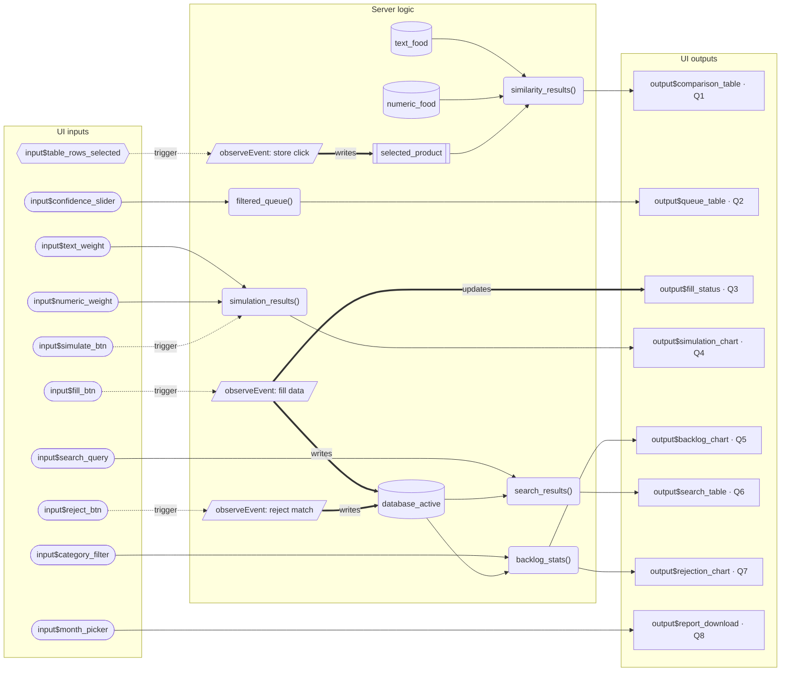

```mermaid
graph LR
    %% Define Subgraphs
    subgraph UI_INPUTS["UI inputs"]
        I1(["input$confidence_slider"])
        I2(["input$search_query"])
        I3(["input$category_filter"])
        I4(["input$month_picker"])
        I5(["input$text_weight"])
        I6(["input$numeric_weight"])
        I7(["input$simulate_btn"])
        I8(["input$fill_btn"])
        I9(["input$reject_btn"])
        E1{{"input$table_rows_selected"}}
    end
    subgraph SERVER_LOGIC["Server logic"]
        D1[("text_food")]
        D2[("numeric_food")]
        D3[("database_active")]
        S1[["selected_product"]]
        O1[/"observeEvent: store click"/]
        O2[/"observeEvent: fill data"/]
        O3[/"observeEvent: reject match"/]
        R1("filtered_queue()")
        R2("similarity_results()")
        R3("simulation_results()")
        R4("search_results()")
        R5("backlog_stats()")
    end
    subgraph UI_OUTPUTS["UI outputs"]
        P1["output$comparison_table · Q1"]
        P2["output$queue_table · Q2"]
        P3["output$fill_status · Q3"]
        P4["output$simulation_chart · Q4"]
        P5["output$backlog_chart · Q5"]
        P6["output$search_table · Q6"]
        P7["output$rejection_chart · Q7"]
        P8["output$report_download · Q8"]
    end
    %% Data Flow & Interactions
    
    %% Q1: Compare products (State -> Conductor -> Output)
    E1 -.->|trigger| O1
    O1 ==>|writes| S1
    D1 --> R2
    D2 --> R2
    S1 --> R2
    R2 --> P1
    
    %% Q2: Filter queue by confidence
    I1 --> R1
    R1 --> P2
    
    %% Q3: Fill missing data (Side effect)
    I8 -.->|trigger| O2
    O2 ==>|writes| D3
    O2 ==>|updates| P3
    
    %% Q4: Simulation (Expensive work waits for button)
    I5 --> R3
    I6 --> R3
    I7 -.->|trigger| R3
    R3 --> P4
    
    %% Q5 & Q7: Backlog & Rejections
    I3 --> R5
    I9 -.->|trigger| O3
    O3 ==>|writes| D3
    D3 --> R5
    R5 --> P5
    R5 --> P7
    
    %% Q6: Search
    I2 --> R4
    D3 --> R4
    R4 --> P6
    
    %% Q8: Export Report
    I4 --> P8
```